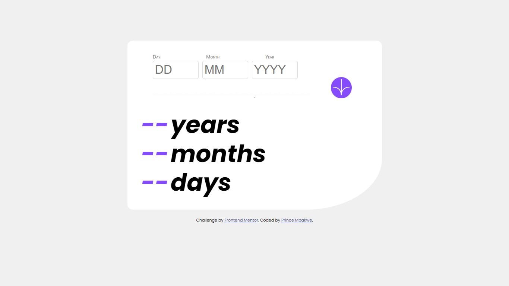

# Frontend Mentor - Age calculator app solution

- [Screenshot](#screenshot)
- [Links](#links)
- [Built with](#built-with)
- [Continued development](#continued-development)
- [Author](#author)

## Overview

Building a dynamic and responsive Age Calculator app

### The challenge

Users should be able to:

- View an age in years, months, and days after submitting a valid date through the form
- Receive validation errors if:
  - Any field is empty when the form is submitted
  - The day number is not between 1-31
  - The month number is not between 1-12
  - The year is in the future
  - The date is invalid e.g. 31/04/1991 (there are 30 days in April)
- View the optimal layout for the interface depending on their device's screen size
- See hover and focus states for all interactive elements on the page
- **Bonus**: See the age numbers animate to their final number when the form is submitted

### Screenshot

### Links

- Solution URL: [Add solution URL here](https://your-solution-url.com)
- Live Site URL: [Add live site URL here](https://www.prince-coder10.github.io/agecalculator)

## My process

It was a fun, interesting and educative process and it was 
calculation intensive too. It put my critical thinking abilities to 
the test. It also put my styling ablilites to the test.  

### Built with

- Semantic HTML5 markup
- CSS custom properties
- Flexbox
- CSS Grid

### What I learned

Being a good programmer or a front-end developer requires skill,  
hard work determination, there were times when i felt like  
giving up, but I had in mind that i have goals to achieve,  
so as to keep my dreams alive. If thers one thing i learned  
is to always put in yor best to achieve your goals.

### Continued development

There is still a lot of areas that need to be improved CSS and JS wise,  
but with practive I know i get there,

## Author

- Frontend Mentor - [@prince-coder10](https://www.frontendmentor.io/profile/prince-coder10)
